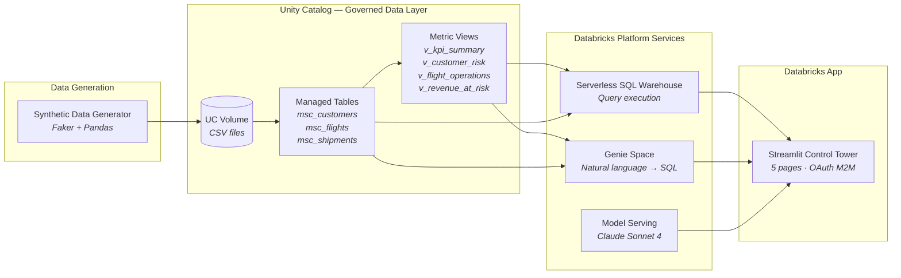

# MSC Air Cargo Control Tower

**Protect revenue, retain VIP customers, and enforce SLA compliance during flight disruptions — powered by Databricks.**

[Live Application](https://msc-cargo-control-tower-7474645572615955.aws.databricksapps.com) | [Developer Guide](DEVELOPER_GUIDE.md) | [Demo Walkthrough](https://docs.google.com/document/d/1etL6lg9Ne2TkjQkWBuNDTlXxHHcLSlevvXa-cL1ub24/edit)

---

## The Business Problem

Air cargo operations face a compounding problem during disruptions: **a single delayed flight can put millions in revenue at risk, damage VIP customer relationships, and trigger SLA penalties** — all within hours.

Traditional operations teams monitor flights in isolation. They see delays, but lack the commercial context to prioritize: Which delayed flight carries $520K of pharmaceutical cargo for a Platinum customer whose sentiment score is already dropping? Which protected flight is 3 hours from breaching its contractual SLA?

Without business-impact ranking, teams treat all disruptions equally — wasting time on low-value recoveries while high-value cargo and key accounts go unprotected.

## The Solution

The Control Tower bridges operational and commercial data to enable **business-impact-driven prioritization**:

| Capability | What It Does | Business Outcome |
|-----------|-------------|-----------------|
| Revenue-at-Risk Scoring | Ranks delays by composite business-impact score (revenue × inverse-sentiment × delay) | Ops teams focus on the highest-value disruptions first |
| VIP Crisis Detection | Auto-surfaces Platinum/VIP cargo on delayed flights, weighted by account health | Account managers get alerted before customers escalate |
| SLA Compliance Tracker | Monitors protected flights against contractual deadlines | Penalty costs are mitigated before breach occurs |
| AI Operations Advisor | Generates specific re-routing and escalation plans per crisis | Reduces decision time from hours to minutes |
| Natural Language Queries | Ask questions in plain English, get instant data answers | No SQL expertise required for ad-hoc investigation |

---

## Data Flow



---

## Technical Architecture

The entire stack runs on Databricks — no external services, no separate cloud infrastructure, no additional authentication systems.

```
 ┌──────────────────────────────────────────────────────────────────────┐
 │                      DATABRICKS PLATFORM                            │
 │                                                                     │
 │  ┌─────────────────────────────────────────────────────────────┐    │
 │  │                    Databricks Apps                          │    │
 │  │   Streamlit application · OAuth M2M · Service Principal     │    │
 │  └──────┬──────────────────┬──────────────────┬────────────────┘    │
 │         │                  │                  │                     │
 │         ▼                  ▼                  ▼                     │
 │  ┌──────────────┐  ┌──────────────┐  ┌────────────────────┐       │
 │  │ SQL Warehouse│  │ Genie Space  │  │  Model Serving     │       │
 │  │ (Serverless) │  │ (NL → SQL)   │  │  (Claude Sonnet 4) │       │
 │  │              │  │              │  │                    │       │
 │  │ KPI queries  │  │ 7 tables +   │  │ Operations advice  │       │
 │  │ Flight data  │  │ views wired  │  │ Crisis response    │       │
 │  │ Shipment     │  │ Join hints   │  │ Action plans       │       │
 │  │ aggregations │  │ Benchmarks   │  │                    │       │
 │  └──────┬───────┘  └──────┬───────┘  └────────────────────┘       │
 │         │                 │                                        │
 │         ▼                 ▼                                        │
 │  ┌─────────────────────────────────────────────────────────────┐   │
 │  │                    Unity Catalog                            │   │
 │  │   Catalog: serverless_stable_3n0ihb_catalog                │   │
 │  │   Schema: msc_air_cargo                                    │   │
 │  │                                                             │   │
 │  │   Tables: msc_customers · msc_flights · msc_shipments      │   │
 │  │   Views:  v_kpi_summary · v_customer_risk                  │   │
 │  │           v_flight_operations · v_revenue_at_risk           │   │
 │  │                                                             │   │
 │  │   Governance: lineage · audit · column-level access control │   │
 │  └─────────────────────────────────────────────────────────────┘   │
 └──────────────────────────────────────────────────────────────────────┘
```

### Component Integration

| Component | Role | Integration Pattern |
|-----------|------|-------------------|
| **Databricks Apps** | Hosts the Streamlit application with managed compute and automatic OAuth | App calls all other services via the Databricks SDK `WorkspaceClient` |
| **Unity Catalog** | Governed data layer — tables, views, volumes, lineage, and access control | App queries UC tables via SQL Warehouse; Genie reads UC metadata for NL understanding |
| **Serverless SQL Warehouse** | Executes all SQL queries with zero infrastructure management | App sends SQL via the Statement Execution API (`/api/2.0/sql/statements`) |
| **Genie Space** | Natural language to SQL interface with domain-specific configuration | App calls the Genie Conversation API; space is configured with 7 tables, join hints, and benchmarks |
| **Model Serving** | Hosts the LLM for AI-powered recommendations and crisis response | App sends prompts via the Serving Endpoint API (`/serving-endpoints/{name}/invocations`) |

---

## Governance & Security

The application follows Databricks governance best practices end-to-end:

**Data Governance (Unity Catalog)**
- All data lives in UC-managed tables with full lineage tracking
- Column-level access control available for sensitive fields
- Every query is audited with the Service Principal identity as actor
- Views encapsulate business logic — the app never writes raw SQL joins for aggregations

**Application Security**
- Authentication is OAuth M2M — no tokens or passwords stored anywhere
- The Service Principal has least-privilege grants: `SELECT` only on the 7 required tables/views
- All configuration is via environment variables (app.yaml) — zero secrets in code
- Resource declarations in app.yaml auto-provision permissions for the SQL Warehouse and Serving Endpoint

**Audit Trail**
- Every SQL query, Genie conversation, and LLM invocation is logged with the SP identity
- Unity Catalog lineage tracks data from source volumes through tables and views to query results
- Databricks Apps logs capture application-level events (errors, deployments, restarts)

---

## AI Strategy: Cloud-Agnostic LLM Access

The Control Tower uses **Claude Sonnet 4** for AI-powered operations advisory and crisis response — served through Databricks Model Serving, not called directly from an external API.

**Why this matters:**

| Principle | How Databricks Delivers It |
|-----------|--------------------------|
| **Cloud Independence** | Databricks runs on AWS, Azure, and GCP. The same app deploys to any cloud without changing a single line of code. No direct cloud-provider AI API dependencies. |
| **Best-of-Breed Model Access** | Databricks Model Serving provides access to models from Anthropic (Claude), Meta (Llama), Google, Mistral, and others — switch models by changing one environment variable. |
| **Price / Performance Optimization** | Route between model providers based on cost, latency, and quality. Use Claude for complex reasoning, Llama for high-throughput summaries — all through the same API. |
| **Unified Governance** | LLM calls go through the same Service Principal, are logged in the same audit system, and respect the same access controls as data queries. No shadow AI. |
| **No Vendor Lock-In** | The app calls `/serving-endpoints/{name}/invocations` — a Databricks API. Swapping from Claude to GPT-4 or Llama requires zero code changes, just a new endpoint name. |

```
App  →  Databricks Model Serving  →  Anthropic (Claude)
                                  →  Meta (Llama)
                                  →  Google (Gemini)
                                  →  Mistral
                                  →  Custom fine-tuned models
```

The LLM is used for two capabilities:
1. **Operations Advisor** (Flight Ops page) — analyzes all delayed flights and their shipments, generates a structured advisory with re-routing options, customer escalation priorities, and SLA protection steps. Output is rendered with styled section cards (urgent/warning/info/success) for rapid scanning.
2. **Crisis Response** (Priority page) — generates immediate action plans for the highest-impact VIP crisis scenario, ranked by composite business-impact score

---

## Key Features

| Page | Feature | Description |
|------|---------|-------------|
| Home | KPI Dashboard | Active flights, on-time rate, revenue at risk, VIP alerts, protected flights |
| Home | Priority Alerts | Auto-ranked by composite crisis score (revenue × inverse-sentiment × delay) |
| Flight Ops | Route Map | Arc visualization with hover tooltips showing flight direction (Origin → Destination) |
| Flight Ops | Delay Heatmap | Intensity-weighted map with grouped hub tooltips (count, avg delay, flight list) |
| Flight Ops | AI Advisor | One-click generation of structured operations advisory for delayed flights |
| Shipments | Revenue Tracker | Filter by commodity, priority, critical revenue flag — with at-risk revenue summary |
| Ask Genie | NL Queries | Ask questions in plain English — Genie translates to SQL and returns structured results |
| Priority | VIP Crisis | Top 5 highest-impact crises ranked by business-impact score with AI-recommended actions |
| Priority | SLA Compliance | Protected flight tracker with breach risk assessment |
| Priority | Sentiment Watch | Flights under intensive monitoring for customer satisfaction impact |

---

## Interactive Map Features

The Flight Ops page includes two interactive map visualizations built with pydeck:

**Route Map (ArcLayer)**
- Color-coded arcs: 🔴 Delayed · 🔵 In-Air · 🟢 On-Time · ⚪ Delivered
- Hover any arc to see flight ID, origin → destination, and status
- Covers 12 global cargo hubs (Chicago, London, Dubai, Tokyo, etc.)

**Delay Heatmap (HeatmapLayer + ScatterplotLayer)**
- Heat intensity weighted by delay minutes — instantly shows regional stress concentration
- Hover hub hotspots for grouped tooltip: number of delayed flights, average delay, and individual flight breakdown
- Up to 5 flights listed per hub with route and delay duration

---

## Quick Start

See the full [Developer Guide](DEVELOPER_GUIDE.md) for detailed installation, code patterns, and permissions reference.

```bash
# 1. Generate synthetic data
cd dataset && pip install faker pandas && python generate_data.py

# 2. Upload to Databricks (requires CLI configured)
databricks fs cp dataset/*.csv dbfs:/Volumes/YOUR_CATALOG/msc_air_cargo/data_files/ --overwrite

# 3. Create tables, views, Genie Space (see Developer Guide)

# 4. Deploy the app
databricks apps deploy msc-cargo-control-tower \
  --source-code-path /Workspace/Users/you@company.com/msc-cargo-control-tower
```

---

## Repository

**GitHub:** [LaurentPRAT-DB/MSC_CARGO_Control_Tower](https://github.com/LaurentPRAT-DB/MSC_CARGO_Control_Tower)

**Live App:** [msc-cargo-control-tower](https://msc-cargo-control-tower-7474645572615955.aws.databricksapps.com)

**Databricks Workspace:** `fevm-serverless-stable-3n0ihb.cloud.databricks.com`
